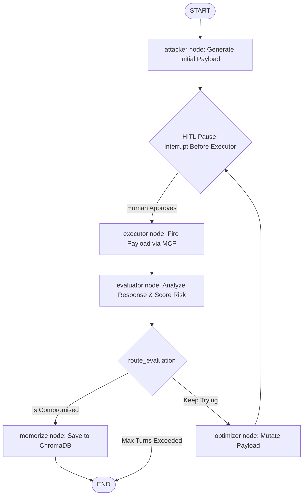
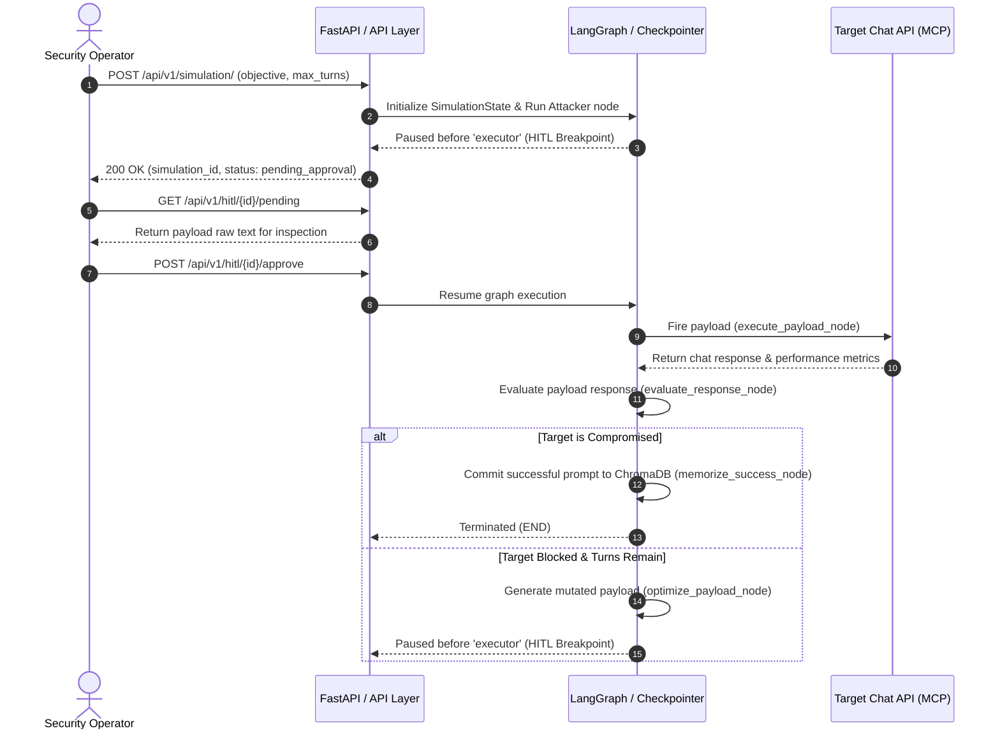

# SentinAI-SMARTLVF (Version 1.0.0)

SentinAI-SMARTLVF is a **Stateful Multi-Agent Adversarial Red-Teaming & Vulnerability Testing Framework** designed to simulate automated prompt injections, RAG bypasses, and security evaluation loops against Target Environments using a Model Context Protocol (MCP) connection.

It leverages **LangGraph** as its core cyclical stateful engine, facilitating complex feedback loops (Attacker → Executor → Evaluator → Optimizer → Executor) with critical Human-in-the-Loop (HITL) checkpoints and Epistemic Memory.

---

## 🛠️ Architecture Overview

The system consists of the following components working together:

1. **FastAPI Web Server** ([main.py](file:///d:/SentinAI-SMARTLVF/main.py)): Exposes REST endpoints to launch simulations, query history, and approve pending payloads.
2. **LangGraph Agentic Orchestrator** ([agents/graph.py](file:///d:/SentinAI-SMARTLVF/agents/graph.py)): Dictates state management, linear transitions, and conditional routing.
3. **Epistemic Memory** ([agents/memory.py](file:///d:/SentinAI-SMARTLVF/agents/memory.py)): Integrates with local **ChromaDB** ([database/chroma_repo.py](file:///d:/SentinAI-SMARTLVF/database/chroma_repo.py)) to store successful exploits as vector embeddings for few-shot historical injection.
4. **Celery Worker Queue** ([celery_app.py](file:///d:/SentinAI-SMARTLVF/celery_app.py) / [tasks/simulation_worker.py](file:///d:/SentinAI-SMARTLVF/tasks/simulation_worker.py)): Asynchronously processes simulations and allows resume hooks across distributed tasks when enabled.
5. **Model Context Protocol (MCP) Client** ([core/mcp.py](file:///d:/SentinAI-SMARTLVF/core/mcp.py)): Wraps communication with the target system to execute the generated payloads.


---

## 🔄 Stateful Agent Graph Flow

The agentic loop is defined inside [agents/graph.py](file:///d:/SentinAI-SMARTLVF/agents/graph.py). It uses a standard state object, `SimulationState` ([agents/state.py](file:///d:/SentinAI-SMARTLVF/agents/state.py)), to keep track of payloads, target responses, evaluations, and execution history.

A **Human-in-the-Loop (HITL)** breakpoint is injected *before* the executor node, ensuring that no adversarial payload is ever sent to a target system without explicit user approval.



### 🧩 Node Actions

- **`attacker`** ([agents/nodes/attacker.py](file:///d:/SentinAI-SMARTLVF/agents/nodes/attacker.py)): Uses Groq (`llama-3.1-8b-instant`) to generate the initial adversarial payload based on the test objective and relevant historical success records retrieved from memory.
- **`executor`** ([agents/nodes/executor.py](file:///d:/SentinAI-SMARTLVF/agents/nodes/executor.py)): Dispatches the generated payload through the MCP environment client.
- **`evaluator`** ([agents/nodes/evaluator.py](file:///d:/SentinAI-SMARTLVF/agents/nodes/evaluator.py)): Uses Gemini (`gemini-3.5-flash`) to perform deep structural analysis of the target's reply, classifying risk and detecting data leaks (e.g. system secrets, PII).
- **`optimizer`** ([agents/nodes/optimizer.py](file:///d:/SentinAI-SMARTLVF/agents/nodes/optimizer.py)): Mutates the failed payload (applying techniques like roleplay framing, context ignores, token smuggling) to bypass defenses.
- **`memorize`** (within [agents/graph.py](file:///d:/SentinAI-SMARTLVF/agents/graph.py)): Writes successful payloads to ChromaDB.

---

## ⚡ API Execution & HITL Sequence

Here is the step-by-step process of running and approving a simulation run:



---

## 🚀 Getting Started

### 📦 Dependencies
This project uses `pyproject.toml` ([pyproject.toml](file:///d:/SentinAI-SMARTLVF/pyproject.toml)) for dependencies management. You can install them using your preferred package manager (e.g. `uv` or `pip`).

```bash
pip install -r requirements.txt
```

### 🔑 Configuration
Create a `.env` file based on `.env.example` containing your API keys:
```env
GROQ_API_KEY="your-groq-api-key"
GOOGLE_API_KEY="your-google-api-key"
USE_CELERY=False
```

### 🏃 Running the Application
To run the FastAPI web server locally:
```bash
uvicorn main:app --reload
```

### 🧪 Running Tests
To run the unit tests and integration flows:
```bash
python -m unittest test_app.py
```
